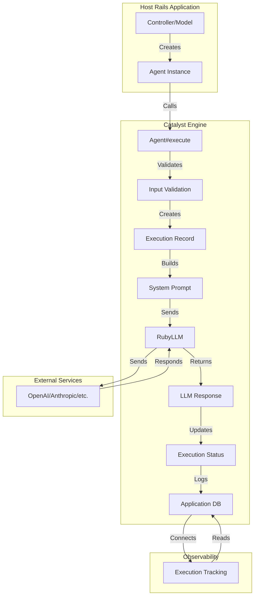

# **Catalyst Framework - Architecture Document**

## **1. Introduction**

This document outlines the overall technical architecture for the **Catalyst Framework**, a Ruby on Rails Engine designed for orchestrating AI agents. It serves as the engineering blueprint for implementing the features and requirements defined in the approved **Product Requirements Document (PRD)**.

The architecture prioritizes a seamless developer experience for Rails developers, production-readiness by default, and long-term extensibility.

### **1.1. Change Log**

| Date | Version | Description | Author |
| :---- | :---- | :---- | :---- |
| 2025-07-08 | 0.1 | Initial high-level architecture draft. | Winston (Architect) |
| 2025-07-11 | 0.2 | Updated to reflect Story 1.3 synchronous execution implementation. | Sarah (PO) |

## **2. High-Level Architecture**

### **2.1. Technical Summary**

The Catalyst Framework is designed as a self-contained **Isolated Rails Engine** that integrates cleanly into any host Rails application. Its core architecture is built around **synchronous agent execution** for immediate responses, leveraging RubyLLM for direct LLM integration.

The framework's data model uses the powerful **Delegated Types** pattern, providing a simple entry point for new users (ApplicationAgent) while offering unlimited flexibility for advanced, custom agent types. This database-centric design, combined with comprehensive execution tracking, ensures the framework is production-ready with full observability from its first version.

### **2.2. High-Level Diagram**

This diagram illustrates the primary components and data flow when a task is initiated from the host Rails application.

### **2.3. Technology Stack**

The Catalyst Framework leverages a modern, production-ready technology stack that prioritizes developer experience and maintainability:

* **Ruby on Rails 8 mountable engine** - Provides the core framework structure with proper namespace isolation
* **Minitest for testing** - Testing framework with test/dummy app for comprehensive engine testing
* **Frontend Stack:**
  - **Hotwire/Turbo/Stimulus** - Modern Rails frontend approach for reactive UIs without complex JavaScript frameworks
  - **TailwindCSS** - Utility-first CSS framework for rapid UI development

### **2.4. Architectural and Design Patterns**

The framework will be built upon a foundation of standard, robust software design patterns that are familiar to Rails developers.

* **Isolated Rails Engine:** The framework will be packaged as an isolated (--mountable) Rails Engine. This is the most critical decision for ensuring the framework is a good citizen in any host application. It namespaces all core models and controllers (e.g., Catalyst::Agent), preventing naming collisions and ensuring clean separation of concerns.
* **Delegated Types Pattern:** This is the core of our agent configuration architecture. It allows us to have a lean base Catalyst::Agent model while providing unlimited flexibility for developers to create their own custom agent types with specific attributes, all without resorting to messy Single Table Inheritance (STI) workarounds.
* **Synchronous Execution Pattern:** All agent executions are performed synchronously using the `Agent#execute` method. This provides immediate responses for single-turn interactions while maintaining comprehensive execution tracking and error handling.
* **Provider Abstraction (via RubyLLM):** RubyLLM handles the adapter pattern internally, providing a unified interface for various LLM providers (OpenAI, Anthropic, Gemini, Ollama, etc.). Catalyst agents can switch providers through simple configuration without any code changes.
* **RubyLLM Tool Pattern:** Tools will inherit from RubyLLM::Tool, leveraging its built-in parameter validation, documentation, and execution patterns. This provides a standardized, battle-tested approach to extending agent capabilities with custom tools.
* **RubyLLM Integration:** The framework deeply integrates with RubyLLM for unified LLM provider access, chat persistence, and tool execution. Default model is `gpt-4.1-nano` with comprehensive multi-provider support. See [RubyLLM Integration](architecture/ruby_llm.md) for detailed patterns and implementation approach.